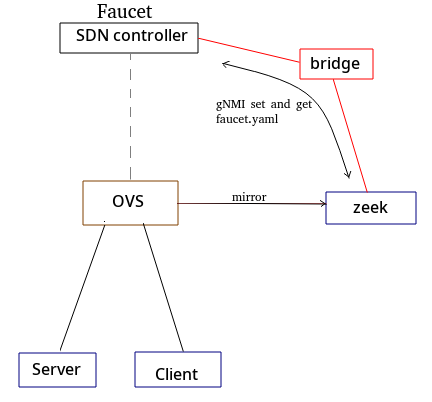

# Dam: SDN and Zeek for automatic threat mitigation.
An attempt to connect Faucet SDN controller with Zeek/BRO IDS using NetControl framework. Such that when Zeek/BRO detects malicious connections it sends events to backend python script which then update faucet.yaml configuration file with the action required.

### Network setup
We utalized docker containers with OVS and docker-ovs.  
The network includes one OVS switch (sw1) and one container for each faucet and three hosts: 
- server on port1 
- client on port2. 
- bro on port3 
Faucet configured to mirror all server in-bound packets (in port1) to bro in port3.

faucet.yaml file is as follows
```
acls:
  block_acl:
  - rule:
      actions:
        allow: false
  def_acl:
  - rule:
      actions:
        allow: true
  mirror_acl:
  - rule:
      actions:
        allow: true
        mirror: 3
dps:
  sw1:
    dp_id: 0x01
    hardware: Open vSwitch
    interfaces:
      1:
        acls_in:
        - mirror_acl
        description: web server
        name: lan2
        native_vlan: office
      2:
        acls_in:
        - def_acl
        description: web client 
        name: lan3
        native_vlan: office
      3:
        description: BRO IDS
        name: BRO
        native_vlan: office
vlans:
  office:
    description: office network
    vid: 101
```
 
## Build the network
You need to have docker, docker-ovs and OVS requirements installed. 
Start by sourcing `setup.sh` file.
```
source setup.sh
```
The `setup.sh` bash file contains scripts to: 
- `generate_gNMI_certs`: create fake certificates and keys for gNMI client and agent between zeek/bro and faucet. 
-`cr_all_conts_with_xterms`: create faucet, bro, server, client docker containers. 
- `get_faucet-gNMI-agent-xterm`: Run faucet gNMI agent on Facuet container.
- `get_X-bash-xterm`: Get another xterm for X container. 
- `create_zeek_net`: Create OVS and connect docker containers.   
- `check_zeek_net`: Check the network setup. 
- `clear_zeek_net_all` Clear all.  
- `faucet_relaod_config` Reload faucet configuration file.  

## Run the test
In this test, Zeek/Bro sends block rules to python script to block a connection that carry the `bash` file (when client request `/bin/bash` file from the webserver). 
```
# log in as root or in docker group
su - 
soruce setup.sh

# generate fake cert for gNMI agent and client
generate_gNMI_certs

# create all containers
cr_all_conts_with_xterms

#make ovs network
create_ovs_net
```
Then follow the follwoing steps:  
1- Start by running faucet gNMI agent
```
get_faucet-gNMI-agent-xterm
```
2- Run python broker. 
It receives zeek events through NetControl framework, and uses `gNMI` to get/set  `faucet.yaml` file from `faucet` container.  
On the xterm window of Zeek run  
```
python simple-client.py
```
3- Run Zeek.  
open new Zeek xterm Zeek/bro window. 
```
get_X-bash-xterm zeek
zeek -C -i eth2 simple-test.bro
```
4- Now run http server on the server xterm 
Now, we are ready to make some connections. On server xterm  run simple web server 
```
python -m http.server 8000
```
4- On client/host xterm run 
```
# send http request to the server
wget http://192.168.0.1:8000/bin/bash
```
This connection should be mirrored by Faucet to Zeek/Bro. 
Zeek/Bro can send drop or allow rules to `simple-client.py` script by sending the 4tuples of the connection `c$id` to drop the connection.   
Python script `simple-client.py` will update the `faucet.yaml` file locally then use `gNMI` to replace `faucet.yaml` file in `faucet` container by the updated one.

This results in blocking the connection between client and server containers on port 8000. 

### Detect and drop binary file transfer based on its hash
Netcontrol frameworks passes drop rule to simple-client.py program, which updates `faucet.yaml` file if the rule is not already installed.  
Try to request `/bin/bash` file through http as following
```
wget http://192.168.0.1:8000/bin/bash
```
The `bash` file MD5 will be detected by `zeek` and drop rule will be sent to 
python container to be insalled in `faucet`.   

Check simple-test.bro
```
event file_sniff(f: fa_file, meta: fa_metadata)
  {
	if ( ! meta?$mime_type ) return;
	
    if ( meta$mime_type == "application/x-executable" ) 
        Files::add_analyzer(f, Files::ANALYZER_MD5);		
  }
event file_hash(f: fa_file, kind: string, hash: string)
  {
	if (kind== "md5" && hash == "8e5b325156981e0bcba714dc32f718c5" ){
		print "Bash binary file md5!";
		for ( cid in f$conns )
		  { 
			#print f$conns[cid]$uid;
			print "Rule is sent to drop connection: ", cid;
			drop_connection(cid, 3600 secs);
		  }		
  	}
  }
```

Python script `Simple-client.py` will install faucet rules to block the connection based on `zeek` `drop_connection` request. Then will send the updated `faucet.yaml` file to `faucet container` and send `HUP` signale to reload the new rules. In general, python scrip can install allow or block rules based on the incomming rule request by `zeek` (`DROP`, `WHITELIST`).


* To delete all network settings for this test (e.e. containers and ovs) run
```
clear_ovs_net_all
```

More about netControl is in here https://docs.zeek.org/en/stable/frameworks/netcontrol.html
Tested with OVS, test script modified from https://github.com/bro/bro-netcontrol/tree/master/test

## Done
- I tested OpenFlow framework and found that `OpenFlow::ofp_match` of the flow only allows to match network ip not host ip!!. look into `misc/of-nc-simple.bro`
- I shifted to NetControl and create two general functions to add/drop rules in `simple-test.bro`.
- Faucet rules will be added always to the top of the `def_acl`, only if the rule is not already exists.
- python script sends HUP signal to faucet container through ssh to reload faucet.yaml. 
- Use gNMI to get/set faucet.yaml file.
- Update all scripts to use zeek instead of bro

## TODO
- Make test scripts.
- Support shunt-flow,whitelist,redirect,quarantine

## Inter-containers communication 
For testing we can use docker API to send HUP signal to faucet, instead of using ssh.
(like here)[https://github.com/alshaboti/dockerSheet/blob/master/README.md#docker-api]
by mounting docker.sock to the container and install docker package
```
-v /var/run/docker.sock:/var/run/docker.sock 
pip install docker
```
then use this script
```
 import docker # pip install docker
 client = docker.from_env()
 container = client.containers.get('faucet')
 container.exec_run("pkill -HUP ryu-manager")
```
## issue
### faucet and ssh
- There is no ssh service running on fuacet container. I tried to install it but no success. 
```
FROM faucet/faucet
RUN apk update 
RUN apk add openrc --no-cache 
RUN apk add openssh-server --no-cache
RUN rc-update add sshd && rc-status 
RUN touch /run/openrc/softlevel 
RUN /etc/init.d/sshd start
RUN /etc/init.d/sshd status
```
I this  error, and ssh crashed
```
 You are attempting to run an openrc service on a
 * system which openrc did not boot.
```

Shift to build fuacet on `ubuntu` rather than add `ssh` service on `faucet/faucet`
image that is based on `Alpine linux`.

### Zeek
- Zeek/bro doesn't sniff files unless python server is running on port 8000?  
- deprecated bro.event usage error in `netcontrol/api.py`. Replace all `broker.bro` by `broker.zeek` in `api.py` file (SOLVED).
### faucetagent
 Reported and solved 
```
# $(<faucet.yaml) not working , need to be "$(<faucet.yaml)"
root@8c57dfa15a14:/pegler/etc/faucet# gnmi_set $AUTH -replace=/:$(<faucet.yaml)
== setRequest:
replace: <
  path: <
  >
  val: <
    string_val: "acls:"
  >
>


# fuser not found
root@8c57dfa15a14:/pegler/etc/faucet# gnmi_set $AUTH -replace=/:"$(<faucet.yaml)"
== setRequest:
replace: <
  path: <
  >
  val: <
    string_val: "acls:\n  block_acl:\n  - rule:\n      actions:\n        allow: false\n  def_acl:\n  - rule:\n      actions:\n        allow: true\n  mirror_acl:\n  - rule:\n      actions:\n        allow: true\n        mirror: 3\ndps:\n  sw1:\n    dp_id: 1\n    hardware: Open vSwitch\n    interfaces:\n      1:\n        acls_in:\n        - mirror_acl\n        description: web server\n        name: lan2\n        native_vlan: office\n      2:\n        acls_in:\n        - def_acl\n        description: web client\n        name: lan3\n        native_vlan: office\n      3:\n        description: BRO IDS\n        name: BRO\n        native_vlan: office\nvlans:\n  office:\n    description: office network\n    vid: 101"
  >
>

F0518 13:13:52.315985      37 gnmi_set.go:160] Set failed: rpc error: code = Unknown desc = Exception calling application: [Errno 2] No such file or directory: 'fuser'


# works but also return error
root@8c57dfa15a14:/pegler/etc/faucet# gnmi_set $AUTH -replace=/:"$(<faucet.yaml)"
== setRequest:
replace: <
  path: <
  >
  val: <
    string_val: "acls:\n  block_acl:\n  - rule:\n      actions:\n        allow: false\n  def_acl:\n  - rule:\n      actions:\n        allow: true\n  mirror_acl:\n  - rule:\n      actions:\n        allow: true\n        mirror: 3\ndps:\n  sw1:\n    dp_id: 1\n    hardware: Open vSwitch\n    interfaces:\n      1:\n        acls_in:\n        - mirror_acl\n        description: web server\n        name: lan2\n        native_vlan: office\n      2:\n        acls_in:\n        - def_acl\n        description: web client\n        name: lan3\n        native_vlan: office\n      3:\n        description: BRO IDS\n        name: BRO\n        native_vlan: office\nvlans:\n  office:\n    description: office network\n    vid: 101"
  >
>

F0518 13:28:21.209323      55 gnmi_set.go:160] Set failed: rpc error: code = Unknown desc = Exception calling application: 'config_files'

```
