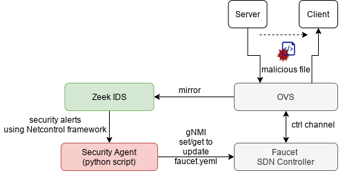

# pegler
An attempt to connect Faucet SDN controller with BRO IDS using NetControl framework. Such that when BRO detects malicious connections it sends events to backend python script which then update faucet.yaml configuration file with the action required.

### Network setup
We utalized docker containers with OVS and docker-ovs.  
The network includes one OVS switch (sw1) and one container for each faucet and three hosts: 
- server on port1 
- client on port2. 
- bro on port3 
Faucet configured to mirror all server in-bound packets (in port1) to bro in port3.

faucet.yaml file is as follows
```
acls:
  block_acl:
  - rule:
      actions:
        allow: false
  def_acl:
  - rule:
      actions:
        allow: true
  mirror_acl:
  - rule:
      actions:
        allow: true
        mirror: 3
dps:
  sw1:
    dp_id: 0x01
    hardware: Open vSwitch
    interfaces:
      1:
        acls_in:
        - mirror_acl
        description: web server
        name: lan2
        native_vlan: office
      2:
        acls_in:
        - def_acl
        description: web client 
        name: lan3
        native_vlan: office
      3:
        description: BRO IDS
        name: BRO
        native_vlan: office
vlans:
  office:
    description: office network
    vid: 101
```
 
## Build the network
You need to have docker, docker-ovs and OVS requirements installed. 
Start by sourcing `bro-test.sh` file.
```
source setup.sh
```
The `setup.sh` bash file contains scripts to: 
- Create faucet, bro, server, client docker containers `cr_all_conts_with_xterms`.
- Get another xterm for bro `get_bro-bash-xterm`.
- Create OVS and connect docker containers `create_bro_net`.  
- Check the network setup `check_bro_net`. 
- Clear all `clear_bro_net_all`. 
- Reload faucet configuration file `faucet_relaod_config`. 

## Run the test
In this test, Bro sends block and allow rules for any connection, for now http connection between client and web server. 

1- Start by running python broker, that will receive Bro events through NetControl framework.
On xterm window of BRO run 
```
python simple-client.py
```
2- Now run Bro instant on the other xterm bro window. 
```
bro -C -i eth2 simple-test.bro
```

3- Now, we are ready to make some connections. On server xterm  run simple web server
```
python -m http.server 8000
```
4- On client/host xterm run 
```
# send http request to the server
curl http://192.168.0.1:8000
```
This connection should be mirrored by Faucet to Bro. 
Bro can send drop or allow rules to `simple-client.py` script by sending the 4tuples of the connection `c$id` to drop or allow connection functions:
``` 
drop_connection(c$id, 4 secs);
allow_connection(c$id, 4 secs);
```
Netcontrol frameworks passes drop rule to simple-client.py program, which updates `faucet.yaml` file if the rule is not already installed. 
### Detect and drop binary file transfer based on its hash
Try to request `/bin/bash` file through http as following
```
curl -O http://192.168.0.1:8000/bin/bash
```
The `bash` file MD5 will be detected by `zeek` and drop rule will be sent to 
python container to be insalled in `faucet`.   

Check simple-test.bro
```
event file_sniff(f: fa_file, meta: fa_metadata)
  {
	if ( ! meta?$mime_type ) return;
	
    if ( meta$mime_type == "application/x-executable" ) 
        Files::add_analyzer(f, Files::ANALYZER_MD5);		
  }
event file_hash(f: fa_file, kind: string, hash: string)
  {
	if (kind== "md5" && hash == "8e5b325156981e0bcba714dc32f718c5" ){
		print "Bash binary file md5!";
		for ( cid in f$conns )
		  { 
			#print f$conns[cid]$uid;
			print "Rule is sent to drop connection: ", cid;
			drop_connection(cid, 3600 secs);
		  }		
  	}
  }
```

* To delete all network settings for this test (e.e. containers and ovs) run
```
clear_bro_net_all
```

More abotu netControl is in here https://docs.zeek.org/en/stable/frameworks/netcontrol.html
Tested with OVS, test script modified from https://github.com/bro/bro-netcontrol/tree/master/test

# Done
- I tested OpenFlow framework and found that `OpenFlow::ofp_match` of the flow only allows to match network ip not host ip!!. look into `misc/of-nc-simple.bro`
- I shifted to NetControl and create two general functions to add/drop rules in `simple-test.bro`.
- Faucet rules will be added always to the top of the `def_acl`, only if the rule is not already exists.
# TODO
- Push updated `faucet.yaml` file to faucet and send it `SIGHUP` signal. 
# issue
- There is no ssh service running on fuacet container. I tried to install it but no success. 
```
FROM faucet/faucet
RUN apk update 
RUN apk add openrc --no-cache 
RUN apk add openssh-server --no-cache
RUN rc-update add sshd && \
    rc-status 
RUN touch /run/openrc/softlevel 

RUN /etc/init.d/sshd start
RUN /etc/init.d/sshd status

```

I this  error, and ssh crashed
```
 You are attempting to run an openrc service on a
 * system which openrc did not boot.
```